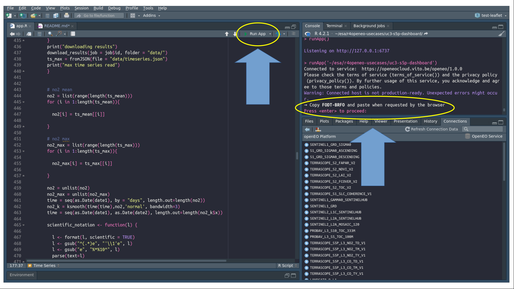
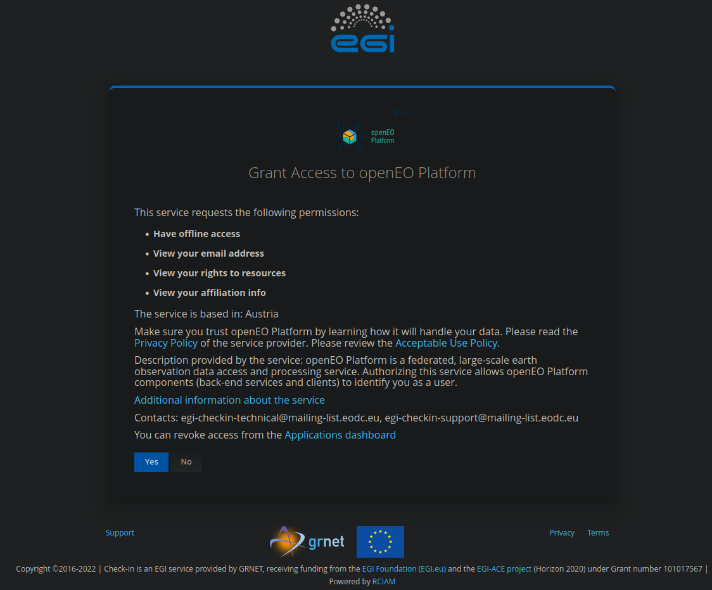
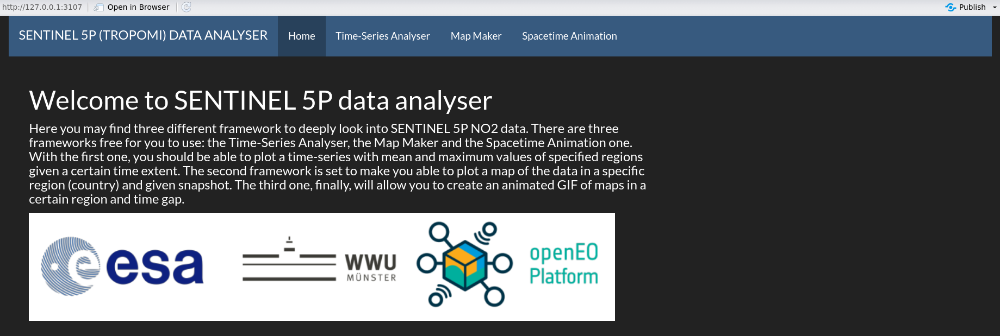
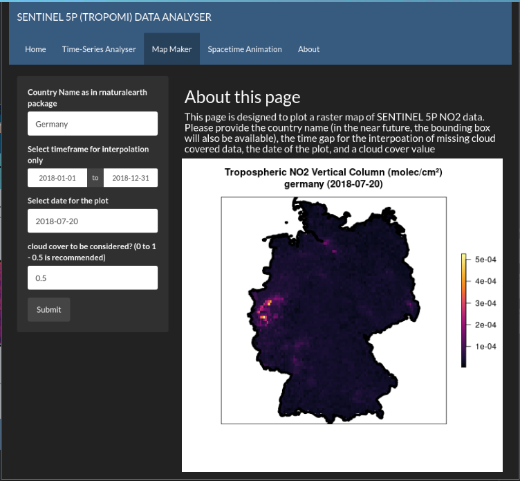
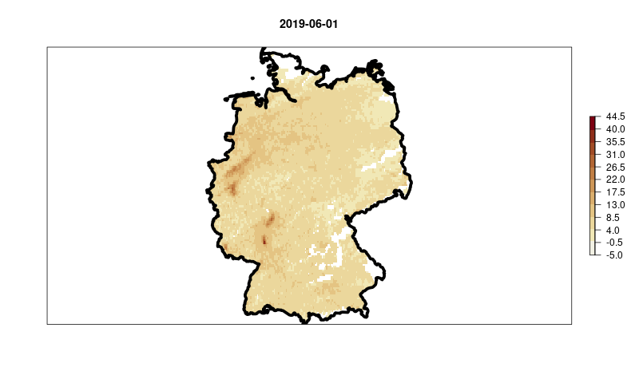

# UC3 : SENTINEL 5P DASHBOARD


An RShiny application to visualise satellite time-series of Sentinel 5P data making use of openEO Platform. There are options for plotting a time-series, a raster of snapshot and creating a spacetime animation. This document should guide on the usage and **installation** of the RShiny application, but shall also guide the creation of new RShiny applications making use of openEO platform toolbox. 

## User Guide

### How to use this RShiny application

This RShiny was designed to run locally, under the recommendation of using RStudio. Therefore, the guidance here present demonstrates how does this RShiny application work and how to make it run. It was also designed to serve as a template for future shiny based application using the openEO platform. In few words, it is mainly meant to drive the creation of other UIs based on shiny and this was lever the use of the openEO platform. For this reason, all the steps are detailed in this README as well as possible. So you can not only reproduce this example, but use it as base for your own ideas. 

As said, it is highly recommended to use RStudio IDE to run this application. Unfortunately, given the fact that it's not possible to login to openEO in a user-less way. Therefore, an interaction with the Console is, at least for now, required. 

After cloning this repository, you may open the [main script](app.R) in RStudio and press "Run App" in the upper part of the IDE. This will start the app, and a few minutes later, it will ask you to press Enter and login through EGI for the openEO platform. It is very important you have access to openEO platform, so you have already credentials to use it. Take a look at the [Services provided](https://openeo.cloud/#plans) and take an option that fits you the best. 



Once you press "Enter", a browser windows or tab should open guiding you through the EGI login. Pass on you credentials, and if you're already logged in, you can simply confirm you agree with the openEO platform requirements by pressing "Yes".



After that, the shiny application shall open and you should be able to see the following RStudio window. If you prefer, you can also open it in your browser.



As you may see, there are three main tabs in the app, besides the home screen : "Time-Series Analyser", "Map Maker", and "Spacetime Animation". We're going to go through examples of all of them, together with some explanations of the ideas behind them.

### Time-Series Analyser

The Time-Series Analyser allows you to see the "reduced" time series of Sentinel 5P NO2 data from a given region. The source code, outside of the [app](app.R), can be found [here](src/time-series.R). Basically, to use this function, the user can pass the coordinates of the bounding box of the area of interest, which are shown in a dynamic map just below; but also the time frame and the cloud cover to be considered in the computation. This last one refers to the percentage (0 to 1) of values that should be really considered as cloud. It works as a quality flag. The recommendation of ESA and the Sentinel documentation is to use 0.5, our default here.

Once all parameters are set, you may just press the "Rocket button" to launch results. As default, the application will try to run the process synchronously, if it refers to a small area, and if it fails, it will send it as a job to be queued in a given back end.

The default coordinates will give you a plot of the Northern Region of Italy, in the region of Bolzano, where we also have some local data for comparison. If your bounding box is inside this region, you'll always see this data, otherwise, you shall see only S5P data.

It's important to mention that the process can take long, especially for bigger areas. It depends a lot on a series of factors, and even the backend you're using. The RStudio Console should give you a hint of how the process is going. It check the status of the backend every minute or so.


### Map Maker for one Snapshot

If your desire is to look at NO2 data at one given point in time, this function in the one you're probably looking for. This second option in the shiny app allows one to visualise how does a country's pattern in NO2 looks like in a given time, following S5P NO2 data. 

The parameters present are the date for the snapshot, the cloud cover quality flag, and the country name. Here, the bounding box could have been an option as well, but so far the idea is just to demonstrate the different options available.



### Spacetime Animation


The spacetime animation option is, to be honest, the funniest of the functions available in the app. Here you can create and visualise your own spatio-temporal animation of S5P NO2 data. Given a starting and ending date, as well as the quality flag for cloud cover and a given country name, you may have your own personalised spacetime GIF ready for your usage. 




## Behind the Scenes

### Time Series Analyser

In order for you to also understand what's going on in the background, we should also explain a little bit about what's going on under the hood. Basically, we first load two collections, S5P data with NO2 band and also Cloud Cover band. In the following, we pass a mask to the NO2 values. This means that, where a cloud is defined (considering the quality flag), no data is passed as the pixel value in the datacube. This happens to leave the datacube with holes in it, which we fill using an interpolation process in the sequence. Once this is done, we reduce the aggregate the datacube spatially using the mean and maximum values. As mentioned, if the study area is small enough, a synchronous process is tried, and if it doesn't work, usually due to a time-out, the process is sent to be queued in the back-end. 

Once that is done, that data shall come as a JSON for download, which is automatically read by the shiny app. A smoothing is applied to the data, so it's better looking and more comprehensible, and to also compare it to a moving average still being applied as a User Defined Function (UDF).


### Map Maker for one Snapshot

Before anything else, you may find [here](src/map-maker.R) the source of the map maker outside of shiny. For creating a plot of a snapshot of NO2 data, the process is quite similar to the time-series analyser. Although, in spite of aggregating the data and reducing the spatial dimensional, with the interpolated data we simply apply a temporal filter, as we download the data as a GeoTiff is spite of JSON. An example of the process graph can be seen below :


### Spacetime Animation

Finally, in order to explain you how does the [spacetime animation](src/spacetime-animation.R) works, we do same steps as in the map maker, ending by the interpolation, although no other processes are applied after that. We simply download all images in the time series as PNGs and we use [gifski](https://cran.r-project.org/web/packages/gifski/index.html) to join them into one GIF file. 


## How to run openEO processes inside an RShiny APP?

As any other rshiny application, we always require an ui and a server. Let's start with the ui, and for now, the one made for the "Time Series Analyser" script. 

```R
 # Application title
    tabPanel( title = "Time-Series Analyser", value = "tab2",

    # Sidebar with a slider input for number of bins
    sidebarLayout(
        sidebarPanel(
          numericInput("w", "xmin (EPSG:4326)", 10.35, min = 0, step = .01),
          numericInput("s", "ymin (EPSG:4326)", 46.10, min = 0, step = .01),
          numericInput("e", "xmax (EPSG:4326)", 12.55, min = 0, step = .01),
          numericInput("n", "ymax (EPSG:4326)", 47.13, min = 0, step = .01),

          # dynamic bbox
          leafletOutput("mymap"),

          # Select time gap
          dateRangeInput("date1date2", "Select timeframe", start = "2019-01-01", end = "2019-01-31",
                         min = "2019-01-01", max = "2020-12-31", startview =  "year", weekstart = "1"),

          numericInput("cloud", "cloud cover to be considered? (0 to 1 - 0.5 is recommended)", 0.5, min = 0, max = 1, step = .1),

          #submit button
          actionButton(inputId = "data1", label = icon("rocket")),
        ),

        # Show a plot of the time series
        mainPanel(
           plotOutput("timeseries")
        )
      )
    ),
```

Here, we first define the "sidebar Panel", which includes all the parameters necessary for the Time-Series Analyser. The first of those are the bounding box coordinates and they're all defined as *numericInput*. As the coordinates draft the leaflet dynamic map, here in the ui we need to simply call the *leafletOutput*, which shall be defined in the server side. After that, we define the *dateRangeInput*, which allow for this pretty way of calling the starting and ending dates. Another *numericInput* also adds the quality flag value for cloud cover. Something else setup here was the *actionButton()*, which forces the script in the server to run only when it has been clicked. This is crucial as the whole processes can take a while and therefore changing the values on-the-fly wouldn't be feasible. It's nice you can add many different icons to the action button, and for this case we picked a rocket, as you can see. Finally, we add the *plotOutput* in the mainPanel... and that's about it !

In the server side, as the algorithm has already been explained before, we'll show how we operate with the inputs from the ui, which is what's the most relevant when working with shiny. 

```R
  # plot bbox
  output$mymap <- renderLeaflet({
    coords_df = data.frame(lon = c(input$w, input$e), lat = c(input$s, input$n)) %>%
      st_as_sf(coords = c("lon", "lat"), crs = 4326) %>%
      st_bbox() %>%
      st_as_sfc

    lon = coords_df %>% st_centroid() %>% st_coordinates() %>% as_tibble() %>%
      pull(X) %>% unlist() %>% as.numeric()

    lat = coords_df %>% st_centroid() %>% st_coordinates() %>% as_tibble() %>%
      pull(Y) %>% unlist() %>% as.numeric()

    leaflet(coords_df) %>%
      addTiles(group = "OpenStreetMap") %>%
      setView(lng = lon, lat = lat, zoom = 20) %>%
      fitBounds(input$w, input$s, input$e, input$n) %>%
      addPolygons(data = coords_df)

  })
```

So, here we demonstrate how the leaflet dynamic map of the bounding box is created. First of all, we make use of sf package to create a bounding (*bbox()*) out of the coordinates defined in the ui; then the coordinates are once again extracted from this sf object so they can be added to function call of the leaflet() function. The view is set to the centroid of the created polygon and a special trick is the *fitBounds()* function, which allows the map to be always inside the visual panel. 

After that, we get again the coordinates, the quality flag and the timestamps for the main algorithm:

```R
output$timeseries <- renderPlot({
      if (input$data1 == 0) return()
      input$data1
      w = input$w
      s = input$s
      e = input$e
      n = input$n
      date1 = input$date1date2[1]
      date2 = input$date1date2[2]
      cloud = input$cloud
```
And the rest is the algorithm itself... which has been already explained before. For the "Map Maker", the main difference is that we don't define a bounding box, but the input is *textInput()* of the country of interest. You can check the differences below :

```R
 tabPanel( title = "Map Maker", value = "tab3",
              sidebarLayout(
                sidebarPanel(
                  textInput("country", "Country Name as in rnaturalearth package", value = 'switzerland'),


                  # Select time gap
                  dateRangeInput("datedate12", "Select timeframe for interpolation only", start = "2018-01-01", end = "2021-12-31",
                                 min = "2018-01-01", max = "2021-12-31", startview =  "year", weekstart = "1"),

                  dateInput("date", "Select date for the plot", min = "2018-01-01", max = "2021-12-31", startview =  "year", weekstart = "1"),

                  numericInput("cloud", "cloud cover to be considered? (0 to 1 - 0.5 is recommended)", 0.5, min = 0, max = 1, step = .1),

                  #submit button
                  actionButton(inputId = "data2", label = icon("rocket")),
                ),

                # Show a plot of the generated distribution
                mainPanel(
                  plotOutput("mapmaker")
                )
                ) #sidebar
              ),#tabpanel
```

The server side of the "Map Maker" then has a very similar composition as the "Time Series" one, although now we work with the text of the country... of course...

```R
 output$mapmaker <- renderPlot({
        if (input$data2 == 0) return()
        input$data2
        # user inputs
        country = input$country
        date1 = input$datedate12[1]
        date2 = input$datedate12[2]
        cloud = input$cloud
        date = input$date
```

For the spacetime animation, the only different parameter is the delay, which is actually a parameter of the gifski function we use. This is used as way to control how fast the animation should be. 

```R
numericInput("delay", "animation speed time in fraction of a second (0.1 to 1)", 0.3, min = 0.1, max = 1, step = .1),
```

And... as you can imagine, the server side call this value as it does with all the other as well. 

```R
 if (input$data3 == 0) return()
        input$data3
```
 Although, the most interesting part here is that we render the figure outputted by the algorithm, so you can see the animation (the GIF) in the shiny APP itself. The ui reference for the following renderer is a simple *plotOutput()* as well. 
 
 ```R
       output$animation <- renderImage({

        filename <- normalizePath(
          file.path('./image',
             paste('spacetime-animation',
                    '.gif', sep='')))
 ```
 
 
## User Defined Function (UDF)

As a little "surprise" in this dashboard, we have added a user defined function (UDF). This is one of the greatest advantages, if not the greatest, of using openEO, and we make use of this dashboard, to also demonstrate how to implement a UDF, and more especially, now inside a shiny app. 


The UDF defined for this rshiny app is a Moving Average one with 30 days window size. The UDF is defined as [a python script](src/udf.py) with a simple implementation of a moving average. In order to call the UDF python script, we basically make use of the process called *run_udf()*, as below :

```R
     # moving average UDF
      ma <- function(data, context){
        p$run_udf(data = data, udf = readr::read_file("src/udf.py"),
                  runtime = "Python"
        )
      }

      datacube_ma = p$apply_dimension(process = ma,
                                      data = datacube, dimension = "t"
      )
```

As you can see, the python script is read as a string, using the r package *readr*. For now, the window of the moving average is hard coded, given issues in the backend, but this is also something that shall be fixed soon. 


## Terrascope and SentinelHub

You may have seen that there's a check box in the beginning of every page of the RShiny. This check box refers to the use of Terrascope. As mentioned, before, the whole script is based on the use of Sentinel Hub, although this option has been very slow and if you just want to have a quick check on the dashboard (as a dashboard, it should also be quicker), you can use Terrascope's data and backend. The only problem with terrascope data is that there's no quality flag there. The data for NO2 in S5P are already pre-processed. It's interesting here, because we add another form of input for shiny, the *checkboxInput()*, which basically delivers a logical/boolean value, optimal defining the *load_collection()* processes later. 

## Dependencies

* R 4.2.1 "Funny Looking Kid"" x86_64, linux-gnu
* RStudio : 2022.07.01

all packages and versions :

* shiny 1.7.1
* shinythemes 1.2.0
* openeo 1.2.1
* raster 3.5-15
* sf 1.0-8
* geojsonsf 2.0.2
* rjson 0.2.21
* ggplot2 3.3.6
* rnaturalearth 1.0.1
* gifski 1.6.6-1
* magick 2.7.3
* ggvis 0.4.7
* leaflet 2.1.1
* dplyr 1.0.10
* readr 2.1.2

